# Module 01: Creating Azure App Service Web Apps

# Lab 01: Building a web application on Azure platform as a service offerings

## Evidences:

#### Exercise 1: Build a back-end API by using Azure Storage and the Web Apps feature of Azure App Service

Created a Storage account:

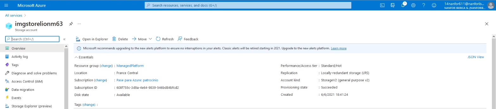

The Connection strings:

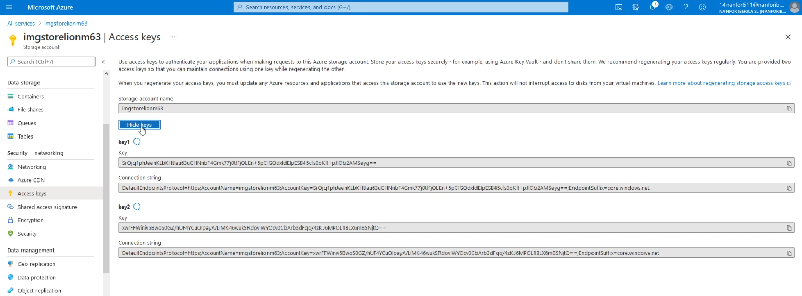

Adding a Container to the Storage Account:

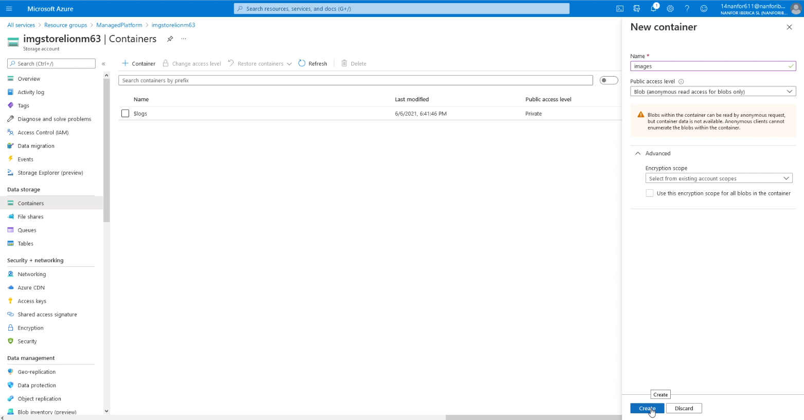

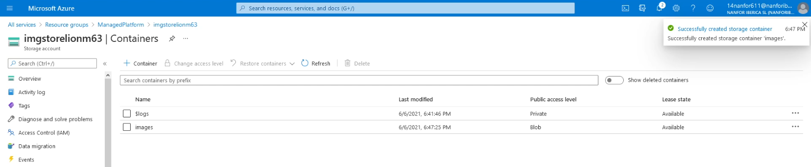

Upload an image to the Container:

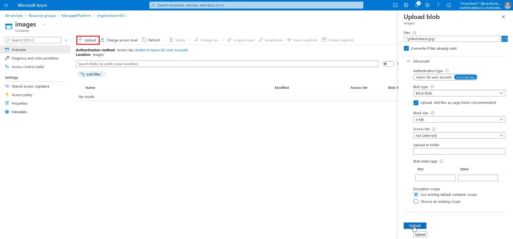

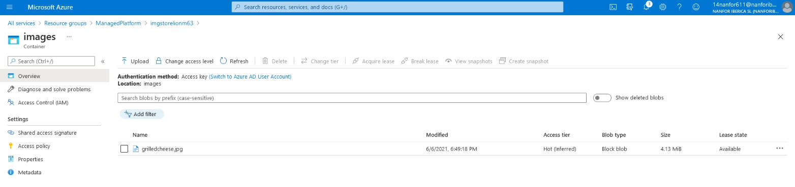

Create a web app for the API:

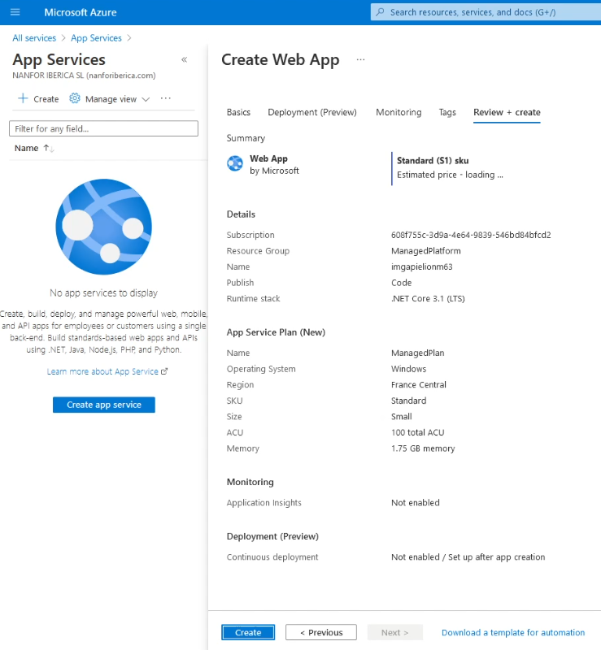

Configure the Web API with the string connection to the Azure Storage:

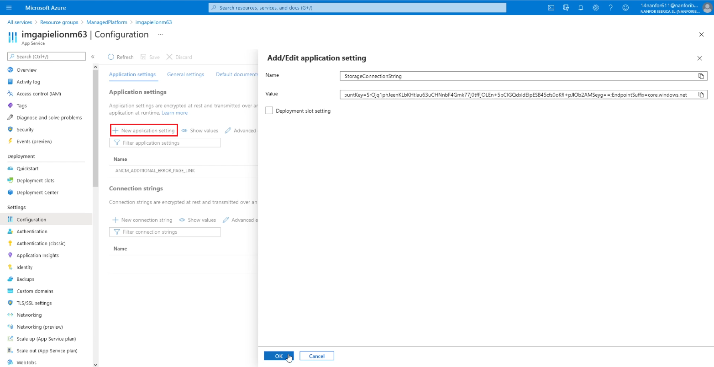

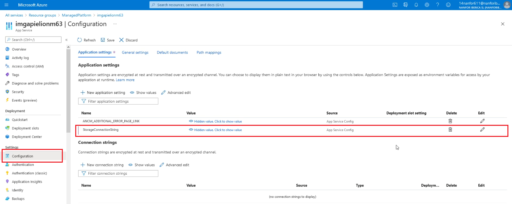

Getting the URL to access the API from the Web client:

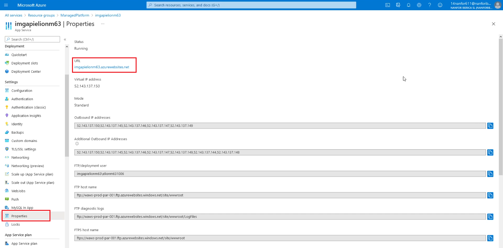

Deploy an ASP.NET web application to the API Web Apps:

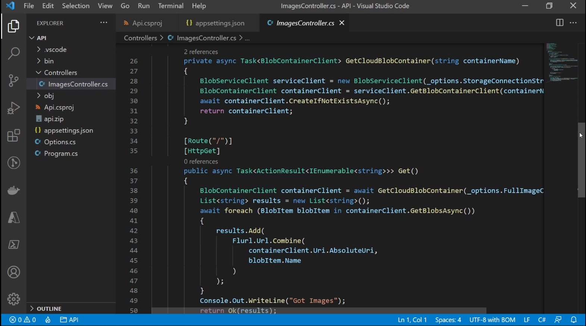

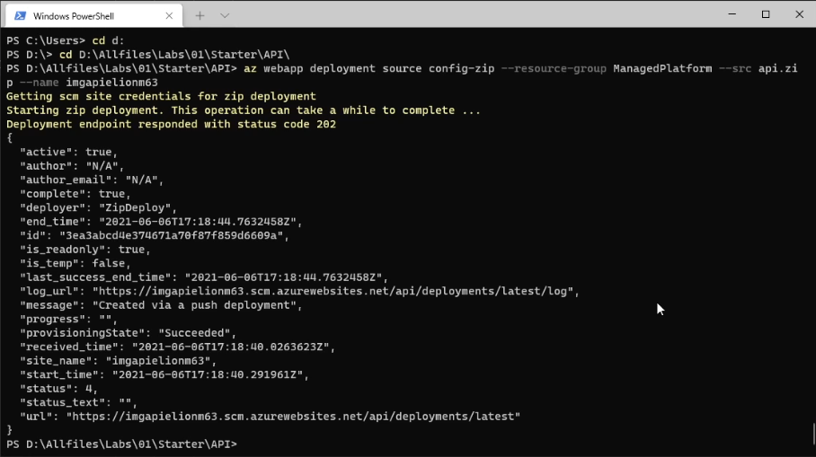

Browse the just created API Web Apps:

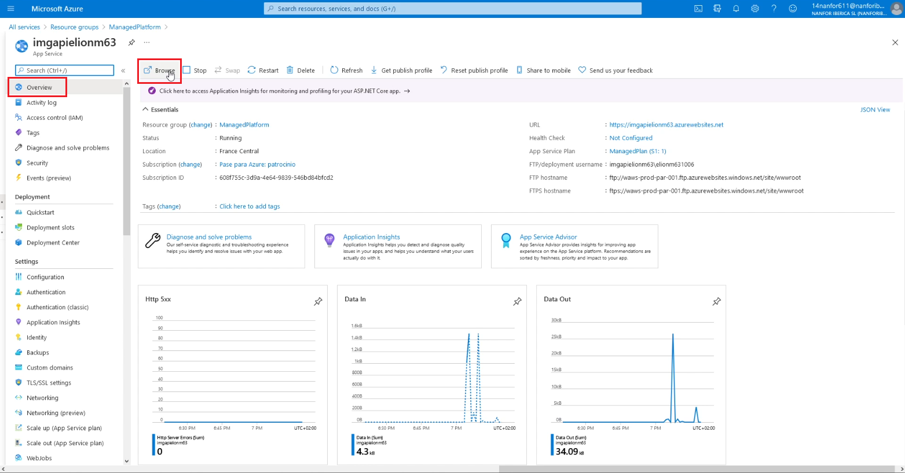

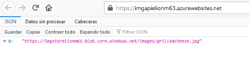

#### Exercise 2: Build a front-end web application by using Azure Web Apps

Created the client web app:

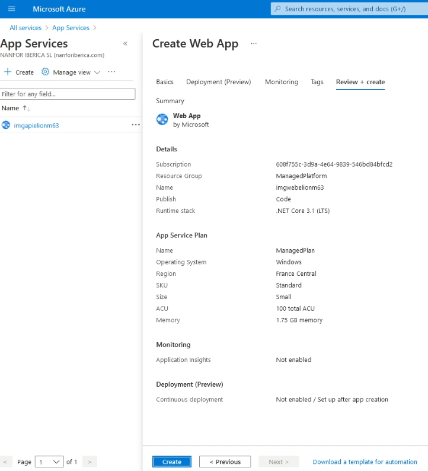

Configure a web client to access the API:

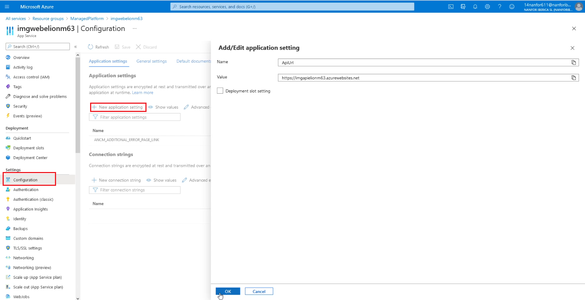

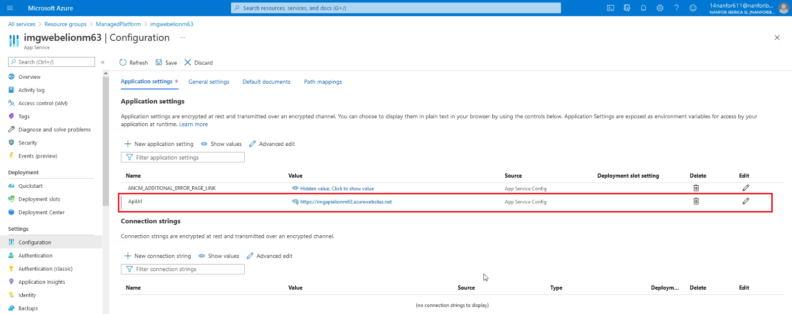

Deploy an ASP.NET web client application to Web Apps:

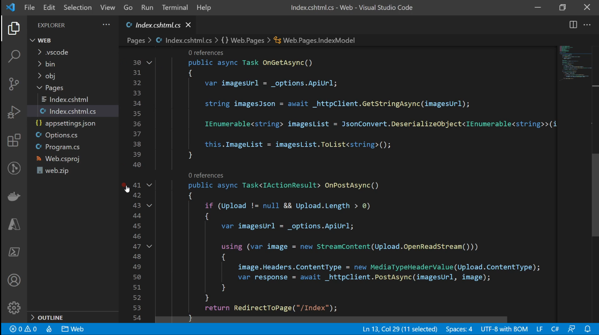

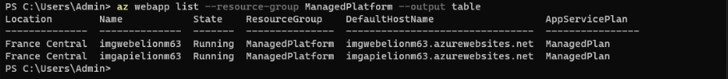

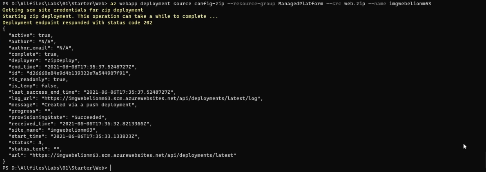

Browse the just created client Web Apps:

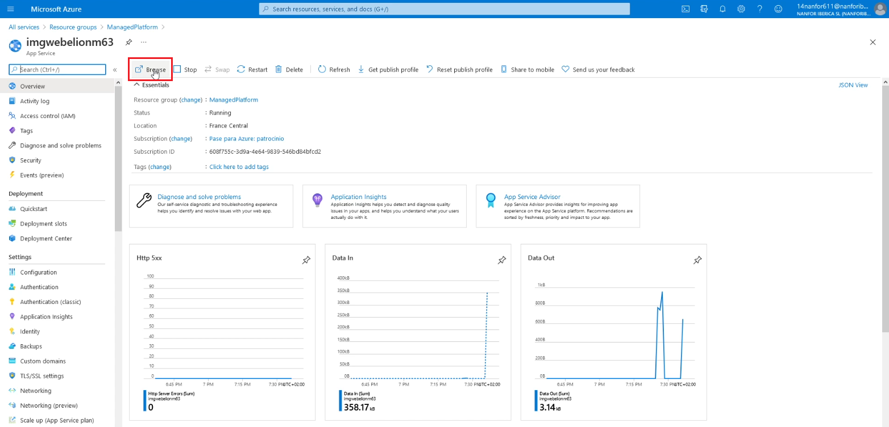

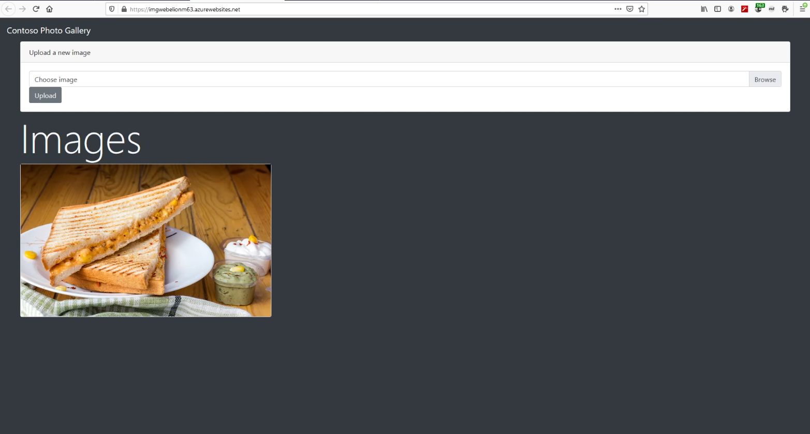

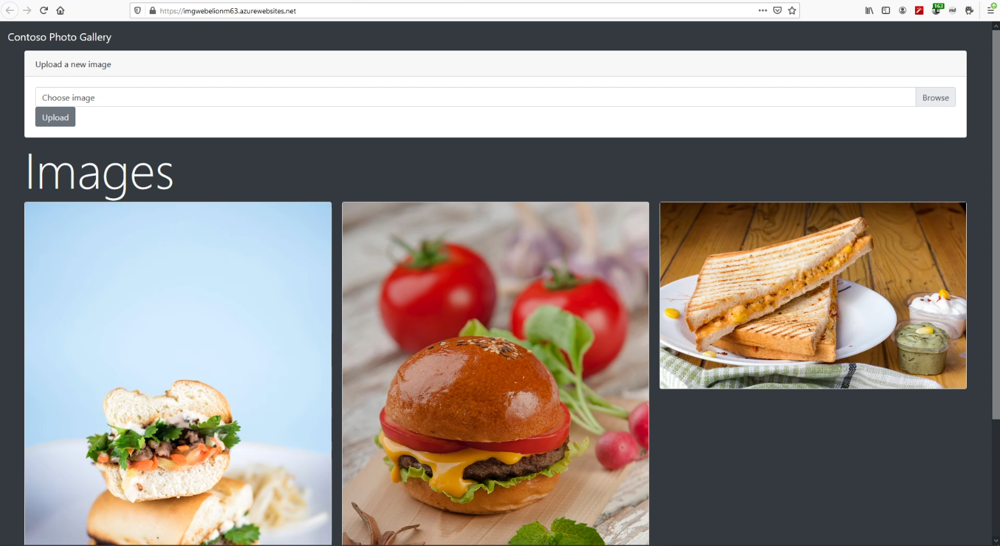

#### Exercise 3: Clean up your subscription

Delete resource groups:

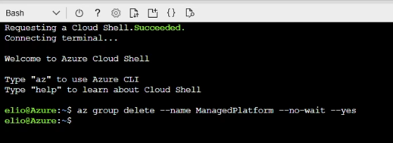

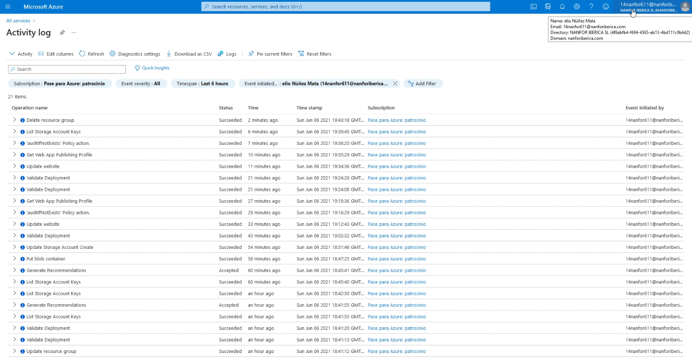

