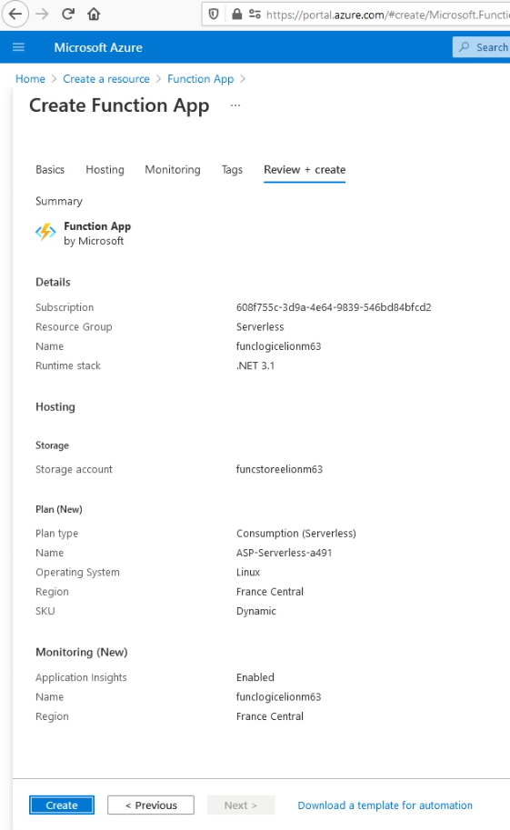
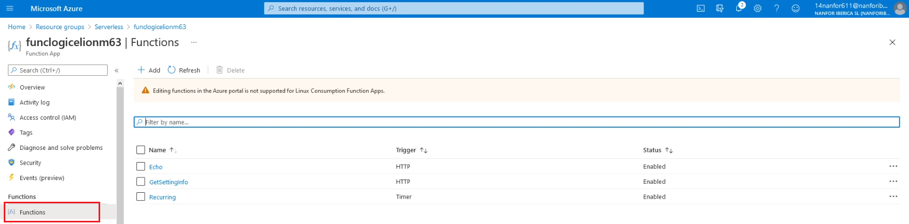

# Module 02: Implement Azure functions

# Lab 02: Implement task processing logic by using Azure Functions

### Exercise 1: Create Azure resources

Created the Azure Storage account:

The the Connection string values:

Created the Function app:

### Exercise 2: Configure a local Azure Functions project

Create a new local Azure Functions project in the current directory :

Configure connection string in the local.settings.json file:

Build the .NET Core 3.1 project:

### Exercise 3: Create a function that’s triggered by an HTTP request

Create the function Echo using the HTTP trigger template:

Customize the function Echo:

Run the function app project:

Test the Echo HTTP-triggered function by using httprepl:

### Exercise 4: Create a function that triggers on a schedule

Create a new function using the **Timer trigger** template:

Running the function app (the function renders a simple message to the log every five minutes):

Modified the function to change the schedule to execute once every 30 seconds:

### Exercise 5: Create a function that integrates with other services

Add a new  Container to the storage account:

Upload the **settings.json** file to the just created container:

 

Create a new function named GetSettingInfo using the HTTP trigger template:

Modify the function to return the content of the **settings.json**  file uploaded:

Test the function by using httprepl:

### Exercise 6: Deploy a local function project to an Azure Functions app

Publishing the function app project:

Validating deployment:

### Exercise 7: Clean up your subscription

Deleted the resource group from Azure Cloud Shell:

